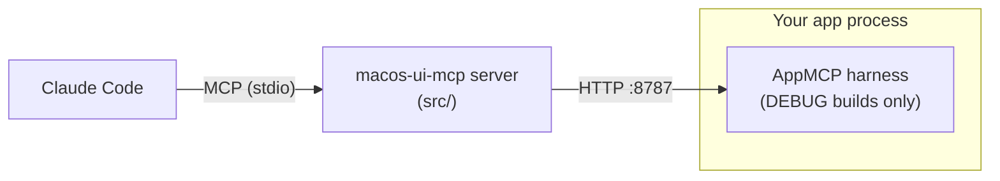
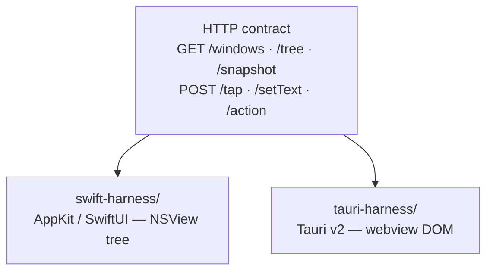
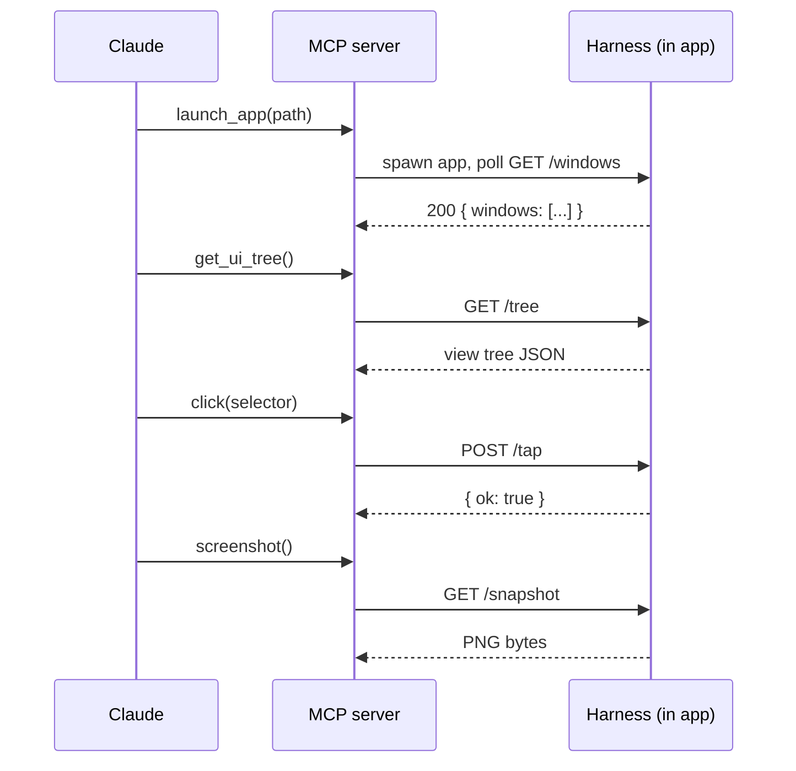

# macos-ui-mcp

A Playwright-style tool that lets **Claude inspect and drive a native macOS app's UI
while you build it — without Screen Recording permission.**

Instead of capturing the screen, the app renders itself. A tiny debug-only harness
inside your app exposes its view tree and an in-process PNG renderer over localhost
HTTP; an MCP server turns that into tools Claude can call.

See [IDEA.md](./IDEA.md) for the design rationale, the architecture comparison, and the
project goals.

## Architecture



The server and the harness talk one shared HTTP contract
([`src/contract.ts`](./src/contract.ts)), so either harness implementation works with
the same MCP tools:



## Tools

| Tool | Does |
|---|---|
| `launch_app` | Launch the target app (`.app` bundle via `open`, or a plain executable) and wait for its harness to come up. |
| `list_windows` | List the app's on-screen windows (id, title, key, frame). |
| `get_ui_tree` | Dump the semantic view tree: roles, labels, values, enabled/focused state, frames, stable ids. |
| `screenshot` | Render a window — or a single node via `selector` — to PNG, in-process. No Screen Recording permission. |
| `click` | Tap a view matched by selector. |
| `type` | Set the text value of a field matched by selector. |
| `invoke_action` | Trigger a named action hook the app registered via `AppMCP.registerAction(name, …)`. |
| `wait_for` | Poll the UI tree until a selector appears, or time out. |

A typical session — Claude launches the app itself, then drives it:



## Layout

| Path | What |
|---|---|
| `src/` | the MCP server (TypeScript) |
| `src/contract.ts` | the harness HTTP wire format (types + zod schemas) |
| `test/` | vitest suite + an in-memory mock harness; `e2e.test.ts` drives the real app |
| `swift-harness/` | drop-in harness for native AppKit / SwiftUI apps |
| `tauri-harness/` | drop-in harness (Tauri v2 plugin) for webview apps |
| `showcase/` | a minimal AppKit app that links the harness — used by the e2e test |

## Use it

### 1. Add the harness to your app (DEBUG builds only)

**AppKit / SwiftUI** — see [`swift-harness/README.md`](./swift-harness/README.md). One line
in your `AppDelegate`:

```swift
#if DEBUG
AppMCP.start()   // opens http://127.0.0.1:8787
#endif
```

**Tauri v2** — see [`tauri-harness/README.md`](./tauri-harness/README.md). Register the
plugin behind `#[cfg(debug_assertions)]` and add `"macos-ui-mcp:default"` to your
capabilities:

```rust
#[cfg(debug_assertions)]
{
    builder = builder.plugin(tauri_plugin_macos_ui_mcp::init());
}
```

### 2. Build the MCP server

```sh
npm install
npm run build
```

### 3. Register it with Claude Code

```jsonc
// .mcp.json
{
  "mcpServers": {
    "macos-ui-mcp": {
      "command": "node",
      "args": ["/absolute/path/to/macos-ui-mcp/dist/index.js"],
      "env": { "MACOS_UI_MCP_HARNESS_URL": "http://127.0.0.1:8787" }
    }
  }
}
```

Now ask Claude to call `launch_app` (path to your `.app` bundle or executable) to start
your debug build and wait for the harness to come up, then `get_ui_tree`, `click`,
`type`, or `screenshot` — no Screen Recording prompt.

## Selector grammar

Used by `click`, `type`, `screenshot`, `wait_for`:

| Form | Matches |
|---|---|
| `#save` | node whose id is `save` (set via `.accessibilityIdentifier("save")` in the app) |
| `Button "Save"` | role `button` **and** label `Save` |
| `"Save"` | any node with label `Save` |
| `Button` | any node with role `button` |

`click` / `type` refuse ambiguous selectors (more than one match) and report the candidate ids.

## Develop

```sh
npm test           # 43 unit tests, no real app needed (mock harness); e2e is skipped
npm run typecheck
npm run dev         # run the server against a live harness

npm run test:e2e    # builds showcase/, launches it, runs the real tools against the
                    # real Swift harness. Needs a logged-in macOS GUI session.
```

`npm run test:e2e` is the proof of the goals: it asserts `get_ui_tree` sees the
controls, `screenshot` returns a real in-process PNG, and `click` / `type` change the
live UI — with no Screen Recording permission.

## Status

- **AppKit / SwiftUI** (`swift-harness/`) — all 7 harness-specific tools. 38 unit tests
  + a 5-case end-to-end test driving the `showcase/` app through the real harness.
  Verified: tree, in-process PNG snapshot, tap, set-text, action hooks — Screen
  Recording off.
- **Tauri v2** (`tauri-harness/`) — plugin compiles (`cargo check` / `clippy` clean);
  full DOM tree, DOM-event interaction, dependency-free snapshot. Not yet exercised by
  an automated end-to-end test in this repo (no Tauri showcase app).
- **`launch_app`** — framework-agnostic (spawns/`open`s whatever path you give it, then
  polls the harness). Unit-tested with a faked `spawn`; manually verified end-to-end
  (`launch_app` → `click` → `screenshot`) against a real Tauri app, not yet wired into
  either automated e2e suite.
- Not yet — SwiftUI-native tree (AppKit introspection only for now), Windows adapter,
  third-party-app inspection via the Accessibility API.

## License

[MIT](./LICENSE) © 2026 Thang Duong
